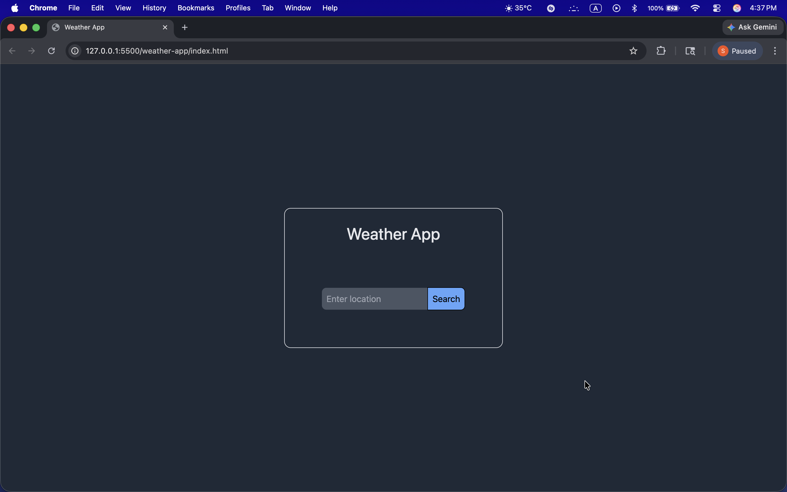
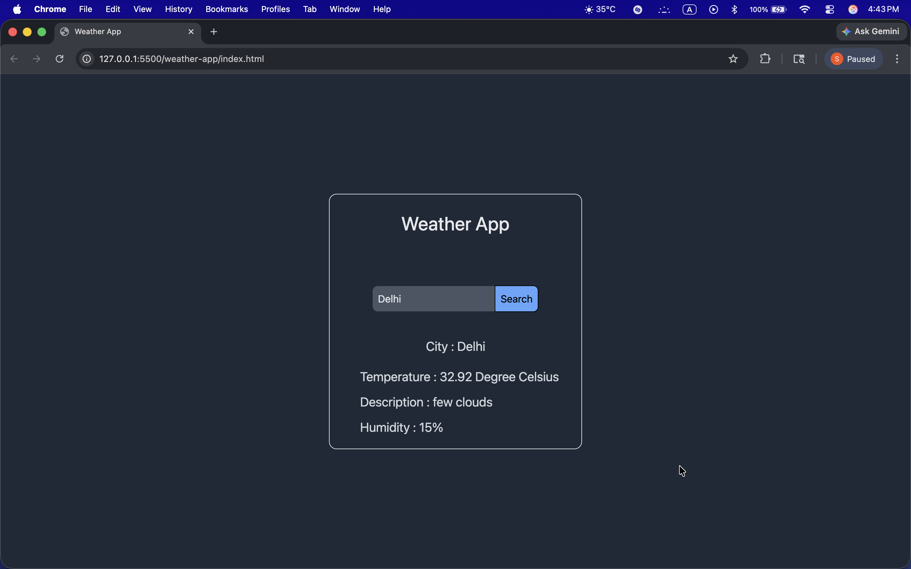

# Weather App
A weather app built with HTML, Tailwind CSS and JavaScript using OpenWeatherMap API.

## Features
- Search weather by city name
- Shows temperature, description and humidity
- Error handling for invalid cities
- Press Enter or click Search to get weather

## Preview

